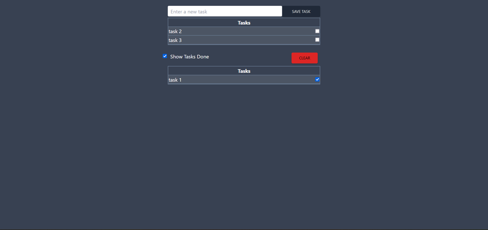

<a name="readme-top"></a>

<!-- PROJECT LOGO -->
<br />
<div align="center">
  
  <h1 align="center">TaskApp localstorge</h1>

  <p align="center">

Task management web page, where tasks are saved in local storage, where you can complete and delete them.
<br />
<br />
<a href="https://fufinop.github.io/taskApp-localstorage/">View Demo</a>
·
<a href="https://github.com/Fufinop/taskApp-localstorage/issues">Report Bug</a>

  </p>
</div>

<!-- TABLE OF CONTENTS -->
<details>
  <summary>Table of Contents</summary>
  <ol>
    <li>
      <a href="#about-the-project">About The Project</a>
      <ul>
        <li><a href="#built-with">Built With</a></li>
      </ul>
    </li>
    <li>
      <a href="#getting-started">Getting Started</a>
      <ul>
        <li><a href="#prerequisites">Prerequisites</a></li>
        <li><a href="#installation">Installation</a></li>
      </ul>
    </li>
    <li><a href="#usage">Usage</a></li>
    <li><a href="#license">License</a></li>
  </ol>
</details>

<!-- ABOUT THE PROJECT -->

## About The Project

This is a practical project on the basics of react, I decided to do it as a practice because it uses several useful technologies in development.

<p align="right">(<a href="#readme-top">back to top</a>)</p>

### Built With

In this section I show the technologies used in this project such as frameworks/libraries.

- [![React][React.js]][React-url]
- [![Tailwind.css][Tailwind.css]][Tailwind.css]
- [![Github Pages][Github Pages]][Github Pages]

<p align="right">(<a href="#readme-top">back to top</a>)</p>

<!-- GETTING STARTED -->

## Getting Started

### Prerequisites

The first thing you need is an updated version of npm

- npm
  ```sh
  npm install npm@latest -g
  ```

### Installation

_The first thing you need to do is clone the repository, then install the dependencies and it is ready to run._

1. Clone the repo
   ```sh
   git clone https://github.com/Fufinop/taskApp-localstorage.git
   ```
2. Install NPM packages
   ```sh
   npm install
   ```
3. Runs the project
   ```js
   npm run dev
   ```

<p align="right">(<a href="#readme-top">back to top</a>)</p>

<!-- LICENSE -->

## License

Distributed under the MIT License. See `LICENSE.txt` for more information.

<p align="right">(<a href="#readme-top">back to top</a>)</p>

<!-- MARKDOWN LINKS & IMAGES -->
<!-- https://www.markdownguide.org/basic-syntax/#reference-style-links -->

[React.js]: https://img.shields.io/badge/React-20232A?style=for-the-badge&logo=react&logoColor=61DAFB
[React-url]: https://reactjs.org/
[Tailwind.css]: https://img.shields.io/badge/Tailwindcss-20232A?style=for-the-badge&logo=TailwindCSS&logoColor=#06B6D4
[Tailwind.css]: https://tailwindcss.com/
[Github Pages]: https://img.shields.io/badge/GhPages-20232A?style=for-the-badge&logo=GitHubPages&logoColor=#222222
[Github Pages]: https://pages.github.com/
